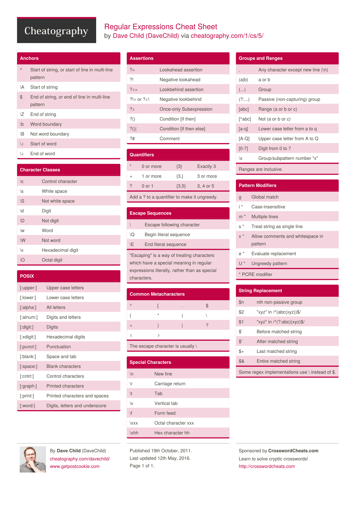

# regex_tutorial

## 正则表达式基础

###符号`^`

`^`指的是匹配字符串开始的位置
`[^指定字符串]` 指的是除指定字符串以外的其他字符串

### 贪婪匹配与非贪婪匹配

`.*` 与 `.*?`
简单说是贪婪匹配与非贪婪匹配的区别。

比如说匹配输入串A: 101000000000100

使用 `1.*1` 将会匹配到1010000000001, 匹配方法: 先匹配至输入串A的最后, 然后向前匹配, 直到可以匹配到1, 称之为贪婪匹配。

使用 `1.*?1` 将会匹配到101, 匹配方法: *匹配下一个1之前的所有字符, 称之为非贪婪匹配。

所有带有量词的都是非贪婪匹配: `.*?`, `.+?`, `.{2,6}?` 甚至 `.??`。其中最后一个中的第一个`?`表示匹配0次到1次。

###断言

`(?=(时候听的|时听的|听的|唱的|里面的|里的|中的|的|音乐|歌曲|歌单|歌|电台|专辑)+)`

`(?=exp)`也叫零宽度正预测先行断言，它断言自身出现的位置的后面能匹配表达式exp。比如`\b\w+(?=ing\b)`，匹配以ing结尾的单词的前面部分(除了ing以外的部分)，如查找I'm singing while you're dancing.时，它会匹配sing和danc.

### cheatsheet



##python下的正则表达式

其中`sub`表示替换，`findall`表示提取。

```python
def remove_bracket(item):
#     rule = re.compile(r"\([^\(\)]*\)$|（[^\(\)]*）$")
# \s空白符，\S非空白符，所以[\s\S]是任意字符
#     rule = re.compile(r"\([\s\S]*\)$|（[\s\S]*）$|（[\s\S]*\)$|\([\s\S]*）$")
    rule = re.compile(r"\([^\(\)（）]*\)|（[^\(\)（）]*）|（[^\(\)（）]*\)|\([^\(\)（）]*）")
    return rule.sub('',item).lower()
#dfsingertemp[dfsingertemp['name'].str.contains("\(")]
#dfsingertemp[dfsingertemp['name'].str.contains("（")]

#use () to extract the specific content, it will return a tuple of list
edition = dict()
def get_bracket(item):
    edition_list = re.findall(r"\(([^\(\)（）]*)\)|（([^\(\)（）]*)）|（([^\(\)（）]*)\)|\(([^\(\)（）]*)）", item)
    if edition_list: # it means not empty list []
        for i in edition_list[0]:
            if i: # it means not empty string "
                edition[i] = edition.get(i, 0) + 1
```


##scala下的正则表达式

其中`regexp_replace`表示替换；`regexp_extract`表示提取。

```scala
val df_sn_sep = df_sn.withColumn("song", regexp_replace($"songname", "[ ]*\\([^\\(\\)]*\\)$", ""))
.withColumn("kind", regexp_extract($"songname", "\\(([^\\(\\)]*)\\)$", 1))
.withColumnRenamed("choric_singer", "singer") //to eliminate the space effect

第一个
[ ]*表示0个或多个空格，
\\(表示为转义为(
[^\\(\\)]表示除了()外的所有字符
\\(([^\\(\\)]*)\\)表示提取除了()之外的任意内容，即([^\\(\\)]*)
```


## hive下的正则表达式

对于在spark中执行hive语句的如果是有s插值在前，则应该为4个转义符，此时scala和hive一起转化；如果没有，则只需2个转义符，此时只有hive进行转化。
也就是说本身hive对()就是要用`\\`两个进行转义的。如果有了插值符号，则要再加一倍。

```hive
select lower(regexp_replace(choric_singer, '[ ]\\([0-9]\\)$', '')) as term from temp.jimmy_new_song_kw where cdt = '2018-06-06';
```

多条件的替换，使用如下`|`符号：
```hive
select lower(regexp_replace(choric_singer, '[ ]*\\([0-9]*\\)| |、', '')) as term from temp.jimmy_new_song_kw where cdt = '2018-06-06';
```


# Reference

- [在线解释正则表达式的意义，强烈推荐](https://regex101.com/#python)